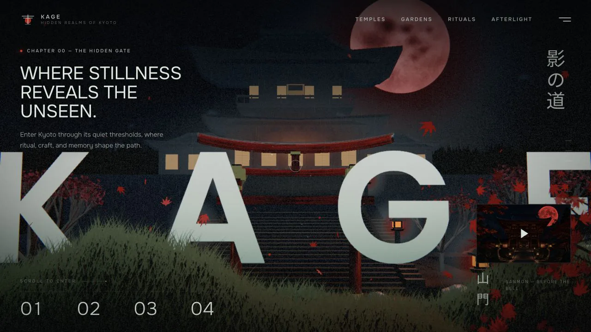

# LANTERN

> Deployed and maintained by **[Saurav Thakur](https://sauravthakurx.vercel.app/)** — [LinkedIn](https://linkedin.com/in/sauravthakurq) · [GitHub](https://github.com/sauravthakurq) · [YouTube](https://www.youtube.com/@SauravThakurx) · [X](https://x.com/SauravThakurx)
>
> **Live site:** https://design-kage.vercel.app
>
> Original project by [Meng To](https://github.com/MengTo). This is a fork; all original authorship and copyright remain with the original author.

An interactive five-chapter night walk through a Kyoto mountain temple, rendered live in Three.js and layered with cinematic generated imagery.

[**View the live project**](https://design-kage.vercel.app) · [**View the source**](https://github.com/sauravthakurq/lantern) · [**Read the build prompt**](PROMPT.md)



## What it does

- Moves a live WebGL camera through a mountain temple as the page scrolls.
- Combines procedural architecture, lantern light, fog, rain, drifting leaves, a vermilion moon, and a restrained bloom pipeline.
- Layers editorial typography, generated scene plates, and alpha-preserving WebP foreground elements over the 3D world, with section-specific fade and blur transitions.
- Includes chapter navigation, a responsive mobile layout, reduced-motion behavior, and a custom cursor for precise pointer devices.

## How it is made

LANTERN is a deliberately small static site. `index.html` contains the document structure, CSS, procedural scene construction, scroll choreography, and interaction logic. A vendored Three.js r149 build provides WebGL rendering without a package manager or build step.

The temple, torii, lanterns, moon, terrain, rain, leaves, fog, and post-processing are constructed at runtime. Optimized WebP scene plates and foreground cutouts sit in normal HTML layers, giving the page its collage-like depth while keeping the camera path and lighting live.

## Build or remix it

The portable implementation brief in [PROMPT.md](PROMPT.md) describes the scene structure, layout system, motion language, and quality constraints needed to rebuild or reinterpret the experience.

## Run locally

From the repository root, run:

```bash
python3 -m http.server 4173 --bind 127.0.0.1
```

Then visit [http://127.0.0.1:4173/](http://127.0.0.1:4173/).

There is no build step, environment variable, analytics script, or runtime network dependency. Python is used only to serve the static files locally; any equivalent static server will work.

## Project structure

```text
kage/
├── index.html
├── PROMPT.md
├── README.md
├── assets/
│   └── kage-preview.webp
└── secret-pathways-assets/
    ├── fonts.css
    ├── three.min.js
    ├── generated/
    └── foreground/png/
```

## Design and attribution

LANTERN is an original, independent design study inspired by Japanese temple architecture and night gardens. It is not affiliated with a specific temple, cultural institution, or tourism organization.

The cinematic scene plates and foreground artwork were generated for this project using GPT Image 2, then art-directed and composed with the live Three.js scene. The vendored Three.js r149 build retains its MIT license notice and copyright attribution.

## More projects

Other single-file experiments in the same vein — no build step, no framework, everything in one HTML document.

- [**VELLUM**](https://complete-shelf-three.vercel.app) — an original Three.js library of seven interactive clothbound hardcovers. · [source](https://github.com/sauravthakurq/vellum)
- [**FOLIO**](https://sketchbook-gold-delta.vercel.app) — a page-flipping sketchbook of Singapore: drag to turn the page, drag the magnifier across it. · [source](https://github.com/sauravthakurq/folio)
- [**PRIMER**](https://github.com/sauravthakurq/primer) — the reusable skill library these pages are built with, including the [falling leaves](https://github.com/sauravthakurq/primer/tree/main/agent-skills/web-design/falling-leaves) and [pointer trail](https://github.com/sauravthakurq/primer/tree/main/agent-skills/web-design/pointer-trail-emitter) techniques extracted from LANTERN.

## License

No license is currently granted for reuse or redistribution of the original LANTERN code or artwork. The third-party Three.js runtime remains covered by its included MIT license notice.

## Connect

- 💼 **LinkedIn** — https://linkedin.com/in/sauravthakurq
- 🌍 **Portfolio** — https://sauravthakurx.vercel.app/
- 💻 **GitHub** — https://github.com/sauravthakurq
- ▶️ **YouTube** — https://www.youtube.com/@SauravThakurx
- 𝕏 **X (Twitter)** — https://x.com/SauravThakurx
